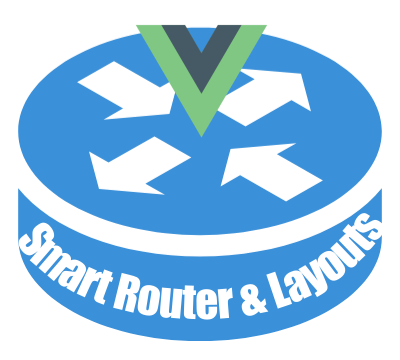

<p align="center">
  <a href="" rel="noopener">
 </a>
</p>

<h3 align="center">Vue Tricks: smart layouts and automatic router</h3>

<div align="center">

  
 
 [](/LICENSE)

</div>

---
### 📝 Table of Contents
- [🧐 About <a name = "about"></a>](#-about-)
- [🏁 Getting Started <a name = "getting_started"></a>](#-getting-started-)
  - [Project setup](#project-setup)
  - [Prerequisites](#prerequisites)
- [👨‍🚀 Author](#-author)
- [🎉 Acknowledgements <a name = "acknowledgement"></a>](#-acknowledgements-)

## 🧐 About <a name = "about"></a>

This repository implements very smart features for large Vue 3 projects with Typescript such as an Automatic Router and Smart Layout system. It's a very clean way to add different layouts dynamically on a Vue Application and at same time handle dynamic and nested routes automatically with middlewares declaring both directly on Vue components. I've learned these great tricks from [here](https://itnext.io/vue-tricks-smart-layouts-for-vuejs-5c61a472b69b) and [here](https://itnext.io/vue-tricks-smart-router-for-vuejs-93c287f46b50).

It's worth to check it out, for sure! 🚀

**P.S.: There's no backend implemented, but only views. You can navigate using the nav links on page, but also there are some dynamic endpoints such as**:
```
-  /posts/1 (or any other id)
-  /posts/edit/1 (or any other id)
```

*Restriction Note: Nested routes can go only one level deep.*
## 🏁 Getting Started <a name = "getting_started"></a>

### Project setup
Install all dependencies:

```
npm install
```

Get eveything up and running:

```
npm run serve
```

In your favorite browser, go to:

```
http://localhost:8080
```

### Prerequisites

If you don't have nodeJS installed yet, [download and install from here](https://nodejs.org/en/)

## 👨‍🚀 Author
| [](https://trepichio.github.io) |
|:--------------------------------------------------:|
| [João Trepichio](https://trepichio.github.io)    |
| [🔥 GitHub](https://github.com/trepichio)
## 🎉 Acknowledgements <a name = "acknowledgement"></a>

- [Article about Smart layouts for VueJS](https://itnext.io/vue-tricks-smart-layouts-for-vuejs-5c61a472b69b)
- [Article about Smart router for VueJS](https://itnext.io/vue-tricks-smart-router-for-vuejs-93c287f46b50)
- [NodeJS](https://nodejs.org/en/)
- [Typescript](http://typescriptlang.org)
- [MDN Javascript](https://developer.mozilla.org/en-US/docs/Web/JavaScript)
- [VueJS](https://vuejs.org)